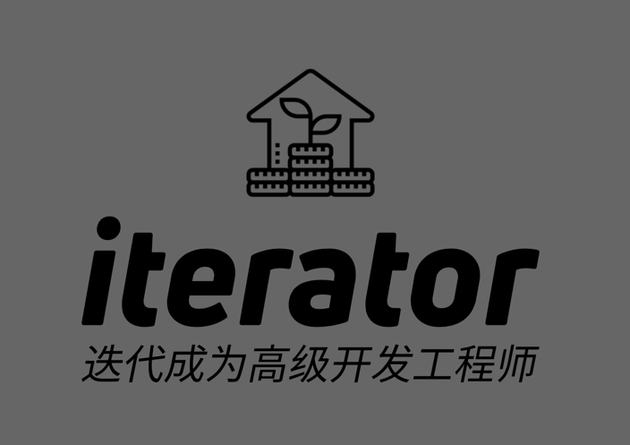

# iterative(迭代成为高级开发工程师)

## 一名高级开发的每日宣言

> 作为一名高级开发工程师。
> 
> 我今天要认真工作，对自己的每一行代码(脚本)、每一行注释、每一页文档负责；
> 
> 今日事，今日毕 ;
> 
> 团队协作，不挖坑给别人，真诚待人，不怕问题；
> 
> 同时，帮助同事，也是在不断解决问题、填坑中提升自己专业能力。 
> 
> 不要忙而无用，每天都应该花时间在提升工作效率和质量上。 
> 
> 只为每天自信、从容； 心安、愉悦。 
> 
> ——  一名高级开发的每日宣言

「Talk is cheap. Show me the code」（屁话少说，放码过来）

> 愿我们总能找到 Bug ，分析问题、解决问题、迭代代码、迭代自己； 阿门、急急如意令； 0 error（s）, 0 warning（s）

## 1. 相信迭代的力量 

- 是投资里的复利
- 是老罗 阿尔法 版本到
- 一副烂牌也要打下去
- 青铜到王者

## Java 建立高级工程师的知识体系有哪些？
1. Java 基础
2. Java 高级
3. Java 并发
4. Java 虚拟机
5. Java 框架
6. Java 工具
7. Java 项目
8. Java 代码规范
9. Java 代码质量
10. Java 代码设计
11. Java 代码重构
12. Java 代码优化
13. Java 代码测试
14. Java 代码调试
15. Java 代码部署
16. Java 代码运维
17. Java 代码监控
18. Java 代码安全
19. Java 代码性能
20. Java 代码可用性
21. Java 代码可维护性
22. Java 代码可扩展性
23. Java 代码可复用性
24. Java 代码可读性
25. Java 代码可测试性

## 以始为终 -- 年终绩效

- 日报
- OKR

## 0. 工欲善其事，利其器：硬件（电脑（操作系统）+ 显示器 + 键盘 + 灯光）、番茄时钟工作法、开发工具及插件

- 高级工程师提交代码也要按规则来
- 1. ChatGPT 注册和使用： https://chat.openai.com/chat
- 靠谱的工程师-作品
- 稳定输出
- Java 学习体系
- Notion AI 一定程度上能治疗对困难任务拖延症， 让你不必从0开始创造，而是描述清楚问题后，让 AI 帮你生成个草稿后，从“修改”开始。
- 用 AI 编写 Shell 脚本很方便
- [免费cursor：Write, edit, and chat about your code with a powerful AI  ](https://www.cursor.so/)
- AI 工具集

> 测试只能证明程序有错误，而不能证明程序没有错误。
> 主进程和子进程，进程小说
迭代💪

